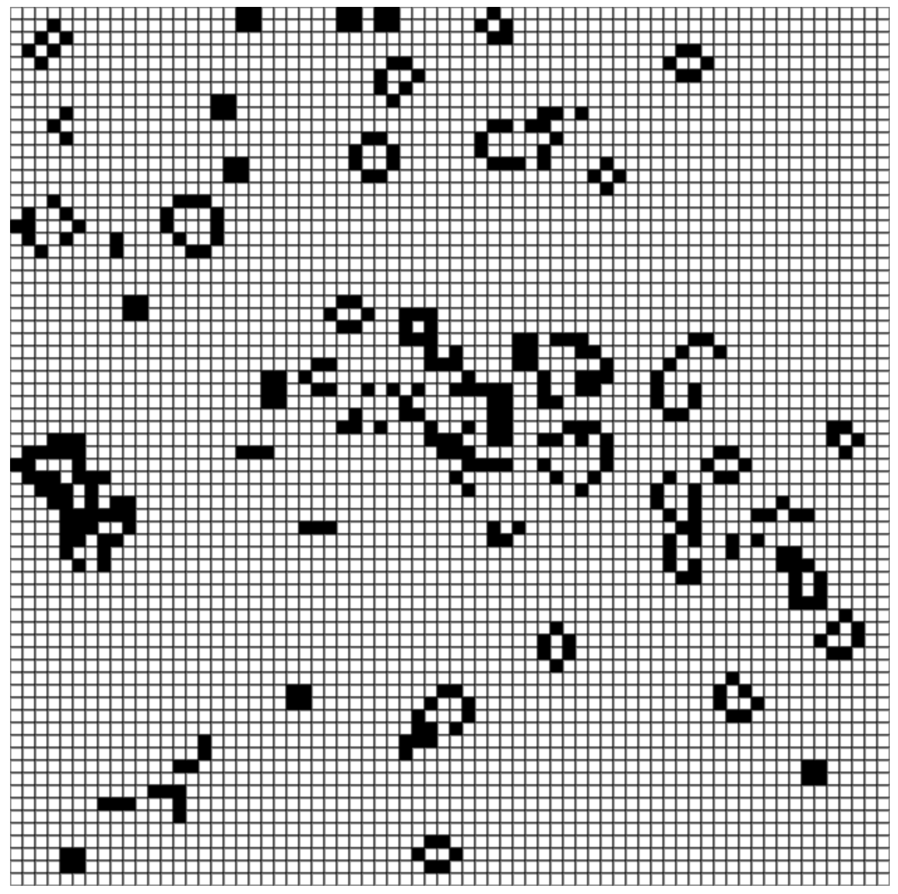

# Rules:
1. Any live cell with fewer than two neighbors dies, as if by underpopulation.
2. Any live cell with two or three live neighbors lives on to next generation.
3. Any live cell with more than three live neighbors dies, as if by overpopulation.
4. Any dead cell exactly three live neighbors becomes a live cell, as if by reproduction.

---

const grid = new Array(COLS).fill(null) 
result:
(10) [ null, null, null, null, null, null, null, null, null, null ]

const grid = new Array(COLS).fill(null)
  .map(() => new Array(ROWS).fill(0))       <-- put 0 here
result:
0: (10) [0, 0, 0, 0, 0, 0, 0, 0, 0, 0]
1: (10) [0, 0, 0, 0, 0, 0, 0, 0, 0, 0]
2: (10) [0, 0, 0, 0, 0, 0, 0, 0, 0, 0]
3: (10) [0, 0, 0, 0, 0, 0, 0, 0, 0, 0]
4: (10) [0, 0, 0, 0, 0, 0, 0, 0, 0, 0]
5: (10) [0, 0, 0, 0, 0, 0, 0, 0, 0, 0]
6: (10) [0, 0, 0, 0, 0, 0, 0, 0, 0, 0]
7: (10) [0, 0, 0, 0, 0, 0, 0, 0, 0, 0]
8: (10) [0, 0, 0, 0, 0, 0, 0, 0, 0, 0]
9: (10) [0, 0, 0, 0, 0, 0, 0, 0, 0, 0]

grid[col][row]
cell = 0 ( col: 0, row: 0)

ctx.rect(col * resolution, row * resolution, resolution, resolution)
col * resolution    <-- X position
col * resolution    <-- Y position

>Telling it to fill in the squares that are alive
new Array(COLS).fill(null)
    .map(() => new Array(ROWS).fill(null)           <-- delete
      .map(() => Math.floor(Math.random() * 2)))    <-- create random 0 and 1 cells
result:
0: (10) [0, 1, 0, 0, 1, 1, 1, 1, 1, 1]
1: (10) [1, 0, 0, 1, 0, 0, 1, 1, 1, 1]
2: (10) [0, 1, 0, 0, 0, 0, 1, 1, 0, 0]
3: (10) [1, 1, 1, 0, 1, 0, 0, 0, 1, 1]
4: (10) [1, 1, 1, 0, 0, 0, 0, 1, 1, 1]
5: (10) [0, 0, 1, 1, 1, 1, 1, 1, 1, 1]
6: (10) [0, 0, 1, 1, 1, 1, 1, 0, 0, 1]
7: (10) [0, 1, 0, 0, 0, 1, 1, 1, 1, 1]
8: (10) [0, 0, 0, 0, 1, 0, 1, 1, 0, 0]
9: (10) [0, 1, 1, 1, 0, 0, 1, 1, 1, 0]

ctx.fillStyle = cell ? 'black' : 'white'
ctx.fill()

---

## Preview:

