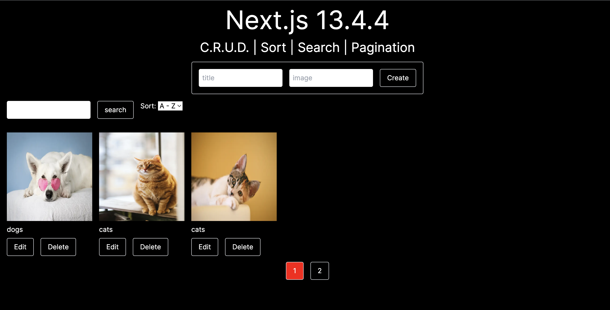

# Next.js 13.4.4 | CRUD, Pagination, Sort | Mongoose

1. ### Setup Next.js

next.config.js

```js
const nextConfig = {
  experimental: {
    serverActions: true,
  },
};
module.exports = nextConfig;
```

2. ### Setup MongoDB (mongoose)

- $ npm i mongoose
- Models (post)
- Connect to MongoDB

lib/mongoose.js

```js
import mongoose from 'mongoose';

const connectDB = () => {
  if (mongoose.connections[0].readyState) {
    console.log('MongoDB is already connected.');
  }

  mongoose
    .connect(process.env.MONGODB_URI)
    .then(() => console.log('MongoDB connected.'))
    .catch((error) => console.log(error));
};

export default connectDB;
```

models/postModel.js

```js
import { Schema, models, model } from 'mongoose';

const postSchema = new Schema(
  {
    title: {
      type: String,
      required: true,
    },
    image: {
      type: String,
      required: true,
    },
  },
  { timestamps: true }
);

const Post = models.post || model('post', postSchema);

export default Post;
```

3. ### Create Post

components/postForm.jsx

```jsx
'use client';
import { useRef } from 'react';
import { createPost } from '@/actions/postActions';

export default function PostForm() {
  const formRef = useRef(null);

  const handleAction = async (formData) => {
    const title = formData.get('title');
    const image = formData.get('image');

    await createPost({ title, image });

    formRef.current.reset();
  };

  return (
    <div>
      <form action={handleAction} ref={formRef}>
        <input type='text' name='title' placeholder='title' required />
        <input type='text' name='image' placeholder='image' required />
        <button type='submit'>Create</button>
      </form>
    </div>
  );
}
```

actions/postActions.js

```js
'use server';
import connectDB from '@/lib/mongoose';
import Post from '@/models/postModel';

connectDB();

export async function createPost(data) {
  try {
    const newPost = await new Post(data);

    await newPost.save();

    return { ...newPost._doc, _id: newPost.id.toString() };
  } catch (error) {
    throw new Error(error.message || 'Failed to create post.');
  }
}
```

4. ### useFormStatus

- Button Submit Component

components/postForm.jsx

```jsx
<ButtonSubmit value='Create' />
```

components/ButtonSubmit.jsx

```jsx
'use client';
import { experimental_useFormStatus as useFormStatus } from 'react-dom';

export default function ButtonSubmit({ value }) {
  const { pending } = useFormStatus();

  return (
    <button type='submit' disabled={pending}>
      {pending ? 'Pending...' : value}
    </button>
  );
}
```

4. ### Get All Posts

actions/postActions.js

```js
export async function getAllPosts() {
  try {
    const posts = await Post.find();

    const newData = posts.map((post) => ({
      ...post._doc,
      _id: post._doc._id.toString(),
    }));

    return { posts: newData };
  } catch (error) {
    throw new Error(error.message || 'Failed to get all posts.');
  }
}
```

app/page.jsx

```jsx
const { posts } = await getAllPosts()
return (
  { posts && <PostList posts={posts} /> }
)
```

5. ### Revalidate Path

```js
export async function createPost(data) {...
  revalidatePath('/')
```

6. ### Edit and Update post

context/Provider.jsx

```jsx
'use client';
import { createContext, useContext, useState } from 'react';

const Context = createContext();

export const useMyContext = () => useContext(Context);

export default function Provider({ children }) {
  const [editPost, setEditPost] = useState(null);
  const value = { editPost, setEditPost };

  return <Context.Provider value={value}>{children}</Context.Provider>;
}
```

components/PostCard.jsx

```jsx
export default function PostCard({ post }) {
  const { setEditPost } = useMyContext();

  return (
    <li>
      <button onClick={() => setEditPost(post)}>Edit</button>
    </li>
  );
}
```

components/PostForm.jsx

```jsx
import { useMyContext } from '@/context/Provider';

export default function PostForm() {...
  const { editPost , setEditPost } = useMyContext()

  const handleAction = async (formData) => {
    const title = formData.get('title');
    const image = formData.get('image');

    if (editPost) {
      await updatePost({ title, image, id: editPost._id })
    } else {
      await createPost({ title, image });
    }

    setEditPost()
    formRef.current.reset();
  };

  return (
  <form action={handleAction}>
    <input
      type='text'
      name='title'
      defaultValue={editPost?.title}
    />
    <input
      type='text'
      name='image'
      defaultValue={editPost?.image}
    />
    {
      editPost
      ? <>
        <ButtonSubmit value='Update' />
        <ButtonSubmit value='Cancel' onClick={() => setEditPost()} />
      </>
      : <ButtonSubmit value='Create' />
    }
  </form>
  )
```

actions/postActions.js

```js
export async function updatePost({ title, image, id }) {
  try {
    const post = await Post.findByIdAndUpdate(id, { title, image }, { new: true });

    revalidatePath('/');

    return { ...post._doc, _id: post._id.toString() };
  } catch (error) {
    throw new Error(error.message || 'Failed to update post.');
  }
}
```

7. ### Delete post | useTransition

actions/postAction.js

```js
export async function deletePost(postId) {
  try {
    const post = await Post.findByIdAndDelete(postId, { new: true });

    revalidatePath('/');

    return { ...post._doc, _id: post._id.toString() };
  } catch (error) {
    throw new Error(error.message || 'Failed to delete post.');
  }
}
```

components/PostCard.jsx

```jsx
'use client';
import { useTransition } from 'react';

export default function PostCard({ post }) {...
  let [isPending, startTransition] = useTransition()

  const handleDelete = async postId => {
    if(window.confirm('Do you want to delete this post?'))
    await deletePost(postId)
  }

  return (
    <button
      onClick={() => startTransition(() => handleDelete(post._id))}
      disabled={isPending}>
      {isPending ? 'Pending...' : 'Delete'}
    </button>
)
```

7. ### Delete post | useOptimistic

> Move handleDelete from PostCard to PostList. And forward to PostCard props.

components/PostList.jsx

```jsx
'use client';
import { experimental_useOptimistic as useOptimistic } from 'react';

export default function PostList({ posts }) {
  const [optimisticPosts, addOptimisticPost] = useOptimistic({ posts }, (state, newPost) => ({
    ...state,
    posts: newPost,
  }));

  const handleDelete = async (postId) => {
    if (window.confirm('Do you want to delete this post?')) {
      const newPosts = posts.filter((post) => post._id !== postId);
      addOptimisticPost((optimisticPosts.posts = newPosts));
      await deletePost(postId);
    }
  };

  return (
    <ul>
      {optimisticPosts.posts.map((post) => (
        <PostCard key={post._id} post={post} handleDelete={handleDelete} />
      ))}
    </ul>
  );
}
```

8. ### Get One Post

actions/postActions.jsx

```jsx
export async function getOnePost(postId) {
  try {
    const post = await Post.findById(postId);

    return { ...post._doc, _id: post._doc._id.toString() };
  } catch (error) {
    throw new Error(error.message || 'Failed to get one post.');
  }
}
```

components/PostCard.jsx

route: `http://localhost:3000/post/648afff4f5b5f4dd7933ecc4`

```jsx
export default function PostCard({ post, handleDelete }) {...

  return (
    <li>
      <Link href={`/post/${post._id}`}>
      ...
  )
```

app/post/[id]/page.jsx

Page has context.

```jsx
export default async function PostDetails(context) {
  console.log(context); // { params: { id: '648afff4f5b5f4dd7933ecc4' }, searchParams: {} }
}
```

```jsx
import { getOnePost } from '@/actions/postActions';
import PostCard from '@/components/PostCard';

export default async function PostDetails({ params: { id }, searchParams }) {
  const post = await getOnePost(id);

  return <div>{post && <PostCard post={post} />}</div>;
}
```

9. ### Search

Put <Feature /> component at app/page.jsx  
Create <SearchForm />

hooks/useCustomRouter.js

```js
import { useRouter, useSearchParams } from 'next/navigation';

export default function useCustomRouter() {
  const router = useRouter();
  const searchParams = useSearchParams();
  const query = {};

  let search = searchParams.get('search');

  if (search) query.search = search;

  const pushQuery = ({ search }) => {
    if (search !== undefined) {
      search === '' ? delete query.search : (query.search = search);
    }

    const newQuery = new URLSearchParams(query).toString();

    router.push(`?${newQuery}`);
  };

  return { pushQuery, query };
}
```

components/SearchForm.jsx

```jsx
'use client';
import useCustomRouter from '@/hooks/useCustomRouter';
import ButtonSubmit from './ButtonSubmit';

export default function SearchForm() {
  const { pushQuery, query } = useCustomRouter();

  const handleSearch = async (formData) => {
    const search = formData.get('search');
    pushQuery({ search });
  };

  return (
    <form action={handleSearch}>
      <input type='search' name='search' defaultValue={query.search || ''} />
      <ButtonSubmit value='search' />
    </form>
  );
}
```

app/page.jsx

```jsx
import { getAllPosts } from '@/actions/postActions';
import Feature from '@/components/Feature';
import PostForm from '@/components/PostForm';
import PostList from '@/components/PostList';

export default async function Home({ params, searchParams }) {
  const { posts } = await getAllPosts(searchParams);

  return (
    <main>
      <PostForm />
      <Feature />
      {posts && <PostList posts={posts} />}
    </main>
  );
}
```

actions/postActions.js

```js
export async function getAllPosts(searchParams) {
  const search = searchParams.search || '';

  try {
    const posts = await Post.find({ title: { $regex: search } });

    const newData = posts.map((post) => ({
      ...post._doc,
      _id: post._doc._id.toString(),
    }));

    return { posts: newData };
  } catch (error) {
    throw new Error(error.message || 'Failed to get all posts.');
  }
}
```

10. ### Sort

components/Sort.jsx

```jsx
'use client';

import useCustomRouter from '@/hooks/useCustomRouter';

export default function Sort() {
  const { pushQuery, query } = useCustomRouter();

  return (
    <div>
      Sort: {` `}
      <select
        className='text-black'
        onChange={(e) => pushQuery({ sort: e.target.value })}
        value={query.sort || 'createdAt'}>
        <option value='createdAt'>A - Z</option>
        <option value='-createdAt'>Z - A</option>
      </select>
    </div>
  );
}
```

hooks/useCustomRouter.js

```js
import { useRouter, useSearchParams } from 'next/navigation';

export default function useCustomRouter() {
  const router = useRouter();
  const searchParams = useSearchParams();
  const query = {};

  let search = searchParams.get('search');
  let sort = searchParams.get('sort'); // ############## ADD

  if (search) query.search = search;
  if (sort) query.sort = sort; // ############## ADD

  const pushQuery = ({ search, sort }) => {
    if (search !== undefined) {
      search === '' ? delete query.search : (query.search = search);
    }

    if (sort !== undefined) {
      // ############## ADD
      sort === 'createdAt' ? delete query.sort : (query.sort = sort);
    }

    const newQuery = new URLSearchParams(query).toString();

    router.push(`?${newQuery}`);
  };

  return { pushQuery, query };
}
```

actions/postActions.js

```js
export async function getAllPosts(searchParams) {
  const search = searchParams.search || '';
  const sort = searchParams.sort || 'createdAt'; // ############## ADD

  try {
    const posts = await Post.find({ title: { $regex: search } }).sort(sort); // ############## ADD

    const newData = posts.map((post) => ({
      ...post._doc,
      _id: post._doc._id.toString(),
    }));

    return { posts: newData };
  } catch (error) {
    throw new Error(error.message || 'Failed to get all posts.');
  }
}
```

11. ### Pagination

- limit
- page
- skip

actions/postActions.js

```js
export async function getAllPosts(searchParams) {
  const search = searchParams.search || '';
  const sort = searchParams.sort || 'createdAt';

  const limit = searchParams.limit * 1 || 3; // ############## ADD
  const page = searchParams.page * 1 || 1; // ############## ADD
  const skip = searchParams.skip * 1 || limit * (page - 1); // ############## ADD

  try {
    const posts = await Post.find({ title: { $regex: search } })
      .sort(sort)
      .limit(limit) // ############## ADD
      .skip(skip); // ############## ADD

    const count = await Post.find({ title: { $regex: search } }).count(); // ############## ADD
    const totalPages = Math.ceil(count / limit); // ############## ADD

    const newData = posts.map((post) => ({
      ...post._doc,
      _id: post._doc._id.toString(),
    }));

    return { posts: newData, count, totalPages }; // ############## ADD
  } catch (error) {
    throw new Error(error.message || 'Failed to get all posts.');
  }
}
```

`http://localhost:3001/?limit=2?skip=1` - try to use query

app/page.jsx

```jsx
export default async function Home({ params, searchParams }) {...
  const { posts, totalPages } = await getAllPosts(searchParams);

  return (
    <main>
      {totalPages && <Pagination totalPages={totalPages} />}
    </main>
  );
}
```

components/Pagination.jsx

```jsx
'use client';
import useCustomRouter from '@/hooks/useCustomRouter';
import ButtonSubmit from './ButtonSubmit';

export default function Pagination({ totalPages }) {
  const pages = [...Array(totalPages)].map((_, index) => index + 1);

  const { pushQuery, query } = useCustomRouter();

  return (
    <div>
      {pages.map((page) => (
        <button onClick={() => pushQuery({ page })} key={page}>
          {page}
        </button>
      ))}
    </div>
  );
}
```

hooks/useCustomRouter.js

```jsx
import { useRouter, useSearchParams } from 'next/navigation';

export default function useCustomRouter() {
  const router = useRouter();
  const searchParams = useSearchParams();
  const query = {};

  let search = searchParams.get('search');
  let sort = searchParams.get('sort');
  let page = searchParams.get('page'); // ############## ADD

  if (search) query.search = search;
  if (sort) query.sort = sort;
  if (page) query.page = parseInt(page); // ############## ADD

  const pushQuery = ({ search, sort, page }) => {
    if (search !== undefined) {
      search === '' ? delete query.search : (query.search = search);
    }

    if (sort !== undefined) {
      sort === 'createdAt' ? delete query.sort : (query.sort = sort);
    }

    if (page !== undefined) {
      // ############## ADD
      page === 1 ? delete query.page : (query.page = page);
    }

    const newQuery = new URLSearchParams(query).toString();

    router.push(`?${newQuery}`);
  };

  return { pushQuery, query };
}
```

components/Pagination.jsx

```jsx
'use client';
import useCustomRouter from '@/hooks/useCustomRouter';

export default function Pagination({ totalPages }) {
  const pages = [...Array(totalPages)].map((_, index) => index + 1);

  const { pushQuery, query } = useCustomRouter();

  return (
    <div className='mt-20 flex justify-center gap-4'>
      {pages.map((page) => (
        <button
          onClick={() => pushQuery({ page })}
          key={page}
          style={{ background: (query.page || 1) === page ? 'red' : 'transparent' }}>
          {' '}
          // ############## ADD
          {page}
        </button>
      ))}
    </div>
  );
}
```

components/SearchForm.jsx

```jsx
pushQuery({ search, page: 1 });
```

12. ### Loading & Error

app/error.jsx

```jsx
'use client';

export default function Error({ error, reset }) {
  return (
    <div className='grid place-content-center'>
      <h1 className='text-4xl my-4'>{error.message}</h1>
      <button className='border rounded py-2 px-4' onClick={reset}>
        Try again
      </button>
    </div>
  );
}
```

## Preview:


