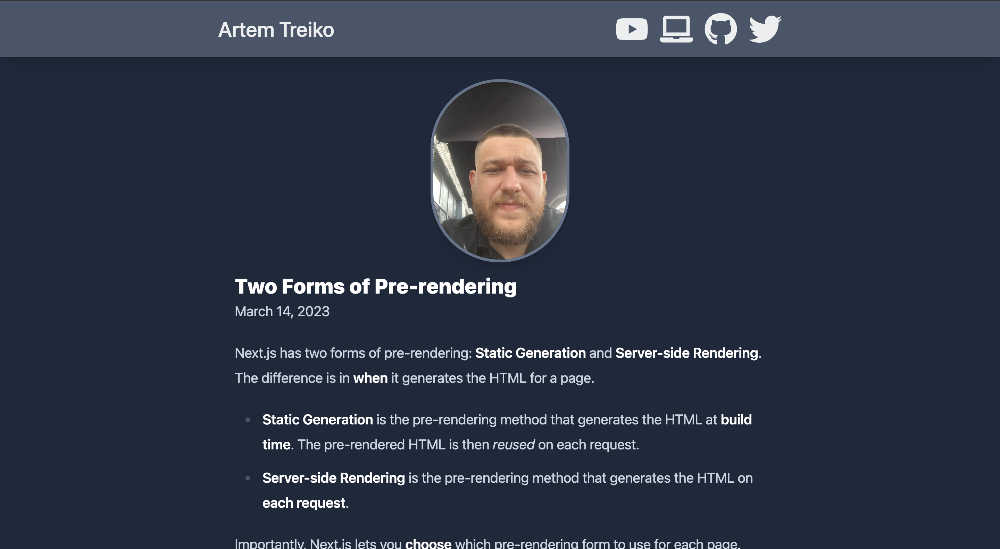

# Next 13 | Blog Website 

**Libs**:  
- tailwind  
- tailwind/typography  
- react-icons  
- gray-matter  
- remark  
- remark-html  

---

- Плагин **"gray-matter"** предназначен для работы с Front Matter — метаданными, которые часто используются в статических сайтах для добавления информации к страницам, например, заголовка, автора, даты публикации. Gray-matter позволяет легко извлекать и обрабатывать эти метаданные из файлов, содержащих контент, например, из файлов формата Markdown, YAML, JSON и других, что позволяет создавать более гибкие и настраиваемые сайты. Gray-matter устанавливается с помощью команды npm install gray-matter и может быть использован как в Node.js-среде, так и в браузере.

- Библиотеки **"remark-html"** и **"remark"** предназначены для преобразования файлов удобных для чтения людьми, таких как Markdown, в HTML для использования веб-страниц. "Remark" это JavaScript библиотека для обработки текстовых файлов, написанных в формате Markdown, "remark-html" плагин для "remark", который генерирует HTML из Markdown. Это позволяет программисту размещать контент в формате Markdown, который может быть легко преобразован в HTML на стороне клиента или сервера. Это удобно для создания динамических веб-страниц, где с помощью Markdown можно описывать контент, а плагин remark-html преобразует его в HTML. Для установки этих библиотек можно использовать команду npm install remark-html remark.

---

## Preview:  

