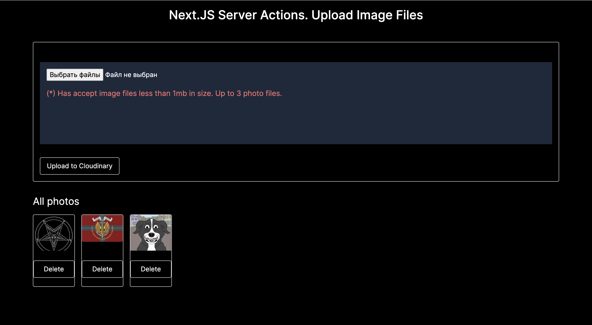

# Next 13.4.10 Upload Images | Server Actions, Cloudinary, Mongoose

.env

```.env
CLOUD_NAME=
CLOUD_API_KEY=
CLOUD_API_SECRET=

MONGODB_URI=
```

1. ### Setup Next.js

next.config.js

```js
const nextConfig = {
  experimental: {
    serverActions: true,
  },
};
module.exports = nextConfig;
```

2. Setup libraries  
   `npm i mongoose cloudinary uuid`

3. Upload Form Content

components/UploadForm.jsx

```jsx
'use client';

import { useRef, useState } from 'react';
import PhotoCard from './PhotoCard';

export default function UploadForm() {
  const [files, setFiles] = useState([]);
  const formRef = useRef(null);

  const handleInputFiles = async (e) => {
    const files = e.target.files; // {objects}

    const newFiles = [...files].filter((file) => {
      // [objects]
      if (file.size < 1024 * 1024 && file.type.startsWith('image/')) {
        // Accept image files only less than 1Mb in size
        return file;
      }
    });
    setFiles((prev) => [...newFiles, ...prev]);
    formRef.current.reset();
  };

  const handleDeleteFiles = async (index) => {
    const newFiles = files.filter((_, i) => i !== index);
    setFiles(newFiles);
  };

  return (
    <form action='' ref={formRef}>
      <div>
        <input onChange={handleInputFiles} type='file' accept='image/*' multiple />
        <h5>(*) Has accept image files less than 1mb in size. Up to 3 photo files.</h5>
        {/* Preview images */}
        <div>
          {files.map((file, index) => (
            <PhotoCard
              onClick={() => handleDeleteFiles(index)}
              url={URL.createObjectURL(file)}
              key={file.name}
            />
          ))}
        </div>
      </div>
      <ButtonSubmit value='Upload to Cloudinary' />
    </form>
  );
}
```

components/ButtonSubmit.jsx

```jsx
import Image from 'next/image';

export default function PhotoCard({ url, onClick }) {
  return (
    <div>
      <div>
        <Image src={url} alt='image' width={100} height={60} priority />
      </div>
      <button type='button' onClick={onClick}>
        Delete
      </button>
    </div>
  );
}
```

4. Upload to Cloudinary

components/UploadForm.jsx

```jsx
  const handleUpload = async (e) => {
    if (!files.length) return alert('No image files are selected.')
    if (files.length > 3) return alert('Upload up to 3 image files.')

    const formData = new FormData()

    files.forEach(file => {
      formData.append('files', file)
    })

    const res = await uploadPhoto()
  }

  <form action={handleUpload}>
```

actions/uploadActions.js

```js
'use server';

import path from 'path';
import fs from 'fs/promises';
import { v4 as uuidv4 } from 'uuid';
import os from 'os';

async function savePhotoToLocal(formData) {
  const files = formData.getAll('files');

  const multipleBuffersPromise = files.map((file) =>
    file.arrayBuffer().then((data) => {
      const buffer = Buffer.from(data);
      // <Buffer ff d8 ff e0 00 10 4a 46 49 46 00 01 02 00 00 01 00 01 00 00 ff ed 00 9c 50 68 6f 74 6f 73 68 6f 70 20 33 2e 30 00 38 42 49 4d 04 04 00 00 00 00 00 80 ... 148404 more bytes>
      const name = uuidv4();
      const ext = file.type.split('/')[1]; // 'jpeg'

      //! Doesn't work in Vercel
      //! const uploadDir = path.join(process.cwd(), 'public', `/${name}.${ext}`);
      // /Users/artemtreiko/Desktop/treiko/sandbox/javascript/next-13/upload-cloudinary-server-actions/public/pentagram.jpeg

      const tempdir = os.tmpdir();
      // /var/folders/ld/lc1vh9rx0sg6myp_gnx1tcv00000gn/T
      const uploadDir = path.join(tempdir, `/${name}.${ext}`);
      // /var/folders/ld/lc1vh9rx0sg6myp_gnx1tcv00000gn/T/346a8abc-d9e1-49c5-bcb4-77e95f790b04.jpeg
      fs.writeFile(uploadDir, buffer);

      return {
        filepath: uploadDir,
        filename: file.name,
      };
    })
  );

  return Promise.all(multipleBuffersPromise);
}

export default async function uploadPhoto(formData) {
  try {
    const newFiles = await savePhotoToLocal(formData);
  } catch (error) {
    return { errorMassage: error.message };
  }
}
```

Set cloudinary variables in .env https://console.cloudinary.com/

.env

```.env
CLOUD_NAME=
CLOUD_API_KEY=
CLOUD_API_SECRET=
```

Add Cloudinary config

```js
import cloudinary from 'cloudinary';

cloudinary.config({
  cloud_name: process.env.CLOUD_NAME,
  api_key: process.env.CLOUD_API_KEY,
  api_secret: process.env.CLOUD_API_SECRET,
});
```

actions/uploadActions.js

```js
async function uploadPhotosToCloudinary(newFiles) {
  const multiplePhotosPromise = newFiles.map((file) =>
    cloudinary.v2.uploader.upload(file.filepath, { folder: 'nextjs_upload' })
  );

  return await Promise.all(multiplePhotosPromise);
}

export default async function uploadPhoto(formData) {
  try {
    // Save photo files to temp folder
    const newFiles = await savePhotosToLocal(formData);
    // Upload to the cloud after saving the photo file to the folder
    const photos = await uploadPhotosToCloudinary(newFiles);
    console.log('photos: ', photos);
    // Delete photo files in temp after successful upload
    newFiles.map((file) => fs.unlink(file.filepath));
    // revalidatePath('/'); todo on client
    return { message: 'Upload Success!' };
  } catch (error) {
    return { errorMessage: error.message };
  }
}
```

Terminal:

```js
photos: [
  {
    asset_id: 'cdd3f1cc84cd9489796389fb3146aa40',
    public_id: 'nextjs_upload/k8dm1iekgrkxayiomgry',
    version: 1689595765,
    version_id: '4dfc3a10bc2c3d4ac07860fc99888e1f',
    signature: 'c7069f72c325a463e87445817cb4116796442d2a',
    width: 1003,
    height: 1001,
    format: 'png',
    resource_type: 'image',
    created_at: '2023-07-17T12:09:25Z',
    tags: [],
    bytes: 754126,
    type: 'upload',
    etag: '1e93655c04e233fce2aea1fccb3da1a6',
    placeholder: false,
    url: 'http://res.cloudinary.com/doh5natmy/image/upload/v1689595765/nextjs_upload/k8dm1iekgrkxayiomgry.png',
    secure_url:
      'https://res.cloudinary.com/doh5natmy/image/upload/v1689595765/nextjs_upload/k8dm1iekgrkxayiomgry.png',
    folder: 'nextjs_upload',
    original_filename: '4b4c945d-8dc4-49be-9e52-54492118575c',
    api_key: '719535148739487',
  },
  {
    asset_id: '8c239215627d0171dad45ec644b7e0ab',
    public_id: 'nextjs_upload/stoi3qxb6abnn90id3fs',
    version: 1689595764,
    version_id: '115a0de0bcec576834c7bd44177bfe83',
    signature: '9aae6e1d842606bda8eea33472ed4e47ef84e97b',
    width: 1000,
    height: 1080,
    format: 'jpg',
    resource_type: 'image',
    created_at: '2023-07-17T12:09:24Z',
    tags: [],
    bytes: 161693,
    type: 'upload',
    etag: '3e07a06112ea15613ebc35775d2c25ed',
    placeholder: false,
    url: 'http://res.cloudinary.com/doh5natmy/image/upload/v1689595764/nextjs_upload/stoi3qxb6abnn90id3fs.jpg',
    secure_url:
      'https://res.cloudinary.com/doh5natmy/image/upload/v1689595764/nextjs_upload/stoi3qxb6abnn90id3fs.jpg',
    folder: 'nextjs_upload',
    original_filename: '3dea390d-3d97-4e31-b37e-a2638853efb2',
    original_extension: 'jpeg',
    api_key: '719535148739487',
  },
  {
    asset_id: 'a948160a5012087f0222ad4180b55b1a',
    public_id: 'nextjs_upload/dzyyhb5o4q66j2hcgmrq',
    version: 1689595764,
    version_id: '115a0de0bcec576834c7bd44177bfe83',
    signature: 'fc6d377a848cd7c42a49043794f17bc98177f8ae',
    width: 2048,
    height: 1340,
    format: 'jpg',
    resource_type: 'image',
    created_at: '2023-07-17T12:09:24Z',
    tags: [],
    bytes: 148454,
    type: 'upload',
    etag: '0a67e183b3b963494c3d53d11bef4578',
    placeholder: false,
    url: 'http://res.cloudinary.com/doh5natmy/image/upload/v1689595764/nextjs_upload/dzyyhb5o4q66j2hcgmrq.jpg',
    secure_url:
      'https://res.cloudinary.com/doh5natmy/image/upload/v1689595764/nextjs_upload/dzyyhb5o4q66j2hcgmrq.jpg',
    folder: 'nextjs_upload',
    original_filename: '1e473d8e-8d73-4632-8fd8-24d7fc98221e',
    original_extension: 'jpeg',
    api_key: '719535148739487',
  },
];
```

5. Get All Photos

next.config.js

```js
const nextConfig = {
  images: {
    domains: ['res.cloudinary.com'],
  },
};
```

actions/uploadActions.js

```js
export async function getAllPhotos() {
  try {
    const { resources } = await cloudinary.v2.search
      .expression('folder: nextjs_upload/*')
      .sort_by('created_at', 'desc')
      .max_results(500)
      .execute();

    return resources;
  } catch (error) {
    return { errorMessage: error.message };
  }
}
```

Terminal:

```
### Result:  {
  total_count: 3,
  time: 2,
  resources: [
    {
      asset_id: 'cdd3f1cc84cd9489796389fb3146aa40',
      public_id: 'nextjs_upload/k8dm1iekgrkxayiomgry',
      folder: 'nextjs_upload',
      filename: 'k8dm1iekgrkxayiomgry',
      format: 'png',
      version: 1689595765,
      resource_type: 'image',
      type: 'upload',
      created_at: '2023-07-17T12:09:25+00:00',
      uploaded_at: '2023-07-17T12:09:25+00:00',
      bytes: 754126,
      backup_bytes: 0,
      width: 1003,
      height: 1001,
      aspect_ratio: 1.002,
      pixels: 1004003,
      url: 'http://res.cloudinary.com/doh5natmy/image/upload/v1689595765/nextjs_upload/k8dm1iekgrkxayiomgry.png',
      secure_url: 'https://res.cloudinary.com/doh5natmy/image/upload/v1689595765/nextjs_upload/k8dm1iekgrkxayiomgry.png',
      status: 'active',
      access_mode: 'public',
      access_control: null,
      etag: '1e93655c04e233fce2aea1fccb3da1a6',
      created_by: [Object],
      uploaded_by: [Object]
    },
    {
      asset_id: 'a948160a5012087f0222ad4180b55b1a',
      public_id: 'nextjs_upload/dzyyhb5o4q66j2hcgmrq',
      folder: 'nextjs_upload',
      filename: 'dzyyhb5o4q66j2hcgmrq',
      format: 'jpg',
      version: 1689595764,
      resource_type: 'image',
      type: 'upload',
      created_at: '2023-07-17T12:09:24+00:00',
      uploaded_at: '2023-07-17T12:09:24+00:00',
      bytes: 148454,
      backup_bytes: 0,
      width: 2048,
      height: 1340,
      aspect_ratio: 1.52836,
      pixels: 2744320,
      url: 'http://res.cloudinary.com/doh5natmy/image/upload/v1689595764/nextjs_upload/dzyyhb5o4q66j2hcgmrq.jpg',
      secure_url: 'https://res.cloudinary.com/doh5natmy/image/upload/v1689595764/nextjs_upload/dzyyhb5o4q66j2hcgmrq.jpg',
      status: 'active',
      access_mode: 'public',
      access_control: null,
      etag: '0a67e183b3b963494c3d53d11bef4578',
      created_by: [Object],
      uploaded_by: [Object]
    },
    {
      asset_id: '8c239215627d0171dad45ec644b7e0ab',
      public_id: 'nextjs_upload/stoi3qxb6abnn90id3fs',
      folder: 'nextjs_upload',
      filename: 'stoi3qxb6abnn90id3fs',
      format: 'jpg',
      version: 1689595764,
      resource_type: 'image',
      type: 'upload',
      created_at: '2023-07-17T12:09:24+00:00',
      uploaded_at: '2023-07-17T12:09:24+00:00',
      bytes: 161693,
      backup_bytes: 0,
      width: 1000,
      height: 1080,
      aspect_ratio: 0.92593,
      pixels: 1080000,
      url: 'http://res.cloudinary.com/doh5natmy/image/upload/v1689595764/nextjs_upload/stoi3qxb6abnn90id3fs.jpg',
      secure_url: 'https://res.cloudinary.com/doh5natmy/image/upload/v1689595764/nextjs_upload/stoi3qxb6abnn90id3fs.jpg',
      status: 'active',
      access_mode: 'public',
      access_control: null,
      etag: '3e07a06112ea15613ebc35775d2c25ed',
      created_by: [Object],
      uploaded_by: [Object]
    }
  ],
  rate_limit_allowed: 500,
  rate_limit_reset_at: 2023-07-17T14:00:00.000Z,
  rate_limit_remaining: 493
}
```

6. Delete Photo

actions/uploadActions.js

```js
export async function deletePhoto(public_id) {
  try {
    await cloudinary.v2.uploader.destroy(public_id);
    revalidate('/');
    return { message: 'Delete Success!' };
  } catch (error) {
    return { errorMessage: error.message };
  }
}
```

7. MongoDB

utils/database.js

```js
import mongoose from 'mongoose';

const connectDB = async () => {
  try {
    if (mongoose.connections[0].readyState) {
      return true;
    }
    await mongoose.connect(process.env.MONGODB_URI);
    console.log('🟢 | MongoDB connected!');
    return true;
  } catch (error) {
    console.log(error);
  }
};

export default connectDB;
```

app/layout.jsx

```jsx
import connectDB from '@/utils/database';

connectDB();
```

models/photoModel.js

```js
import { Schema, model, models } from 'mongoose';

const photoSchema = new Schema(
  {
    public_id: String,
    secure_url: String,
  },
  { timestamps: true }
);

const Photo = models.photos || model('Photo', photoSchema);

export default Photo;
```

Add to MongoDB:

actions/uploadActions.js

```js
export async function uploadPhoto(formData) {
  try {
    const newFiles = await savePhotosToLocal(formData);
    const photos = await uploadPhotosToCloudinary(newFiles);

    newFiles.map((file) => fs.unlink(file.filepath));

    const newPhotos = photos.map((photo) => {
      const newPhoto = new Photo({
        public_id: photo?.public_id,
        secure_url: photo?.secure_url,
      });

      return newPhoto;
    });

    await Photo.insertMany(newPhotos);

    return { message: 'Upload Success!' };
  } catch (error) {
    return { errorMessage: error.message };
  }
}
```

Get All from MongoDB

actions/uploadActions.js  


```js
export async function getAllPhotos() {
  try {
    // todo get all photos from Cloudinary
    // const { resources } = await cloudinary.v2.search
    //   .expression('folder: nextjs_upload/*')
    //   .sort_by('created_at', 'desc')
    //   .max_results(500)
    //   .execute();

    // todo get all photos from MongoDB
    const photos = await Photo.find().sort('-createdAt');

    const resources = photos.map((photo) => ({ ...photo._doc, _id: photo._id.toString() }));

    return resources;
  } catch (error) {
    return { errorMessage: error.message };
  }
}
```

Delete Photo from MongoDB

actions/uploadActions.js  

```js
export async function deletePhoto(public_id) {
  try {
    await Promise.all([
      Photo.findOneAndDelete({ public_id }),
      cloudinary.v2.uploader.destroy(public_id),
    ]);

    revalidate('/');
    return { message: 'Delete Success!' };
  } catch (error) {
    return { errorMessage: error.message };
  }
}
```

## Preview:


