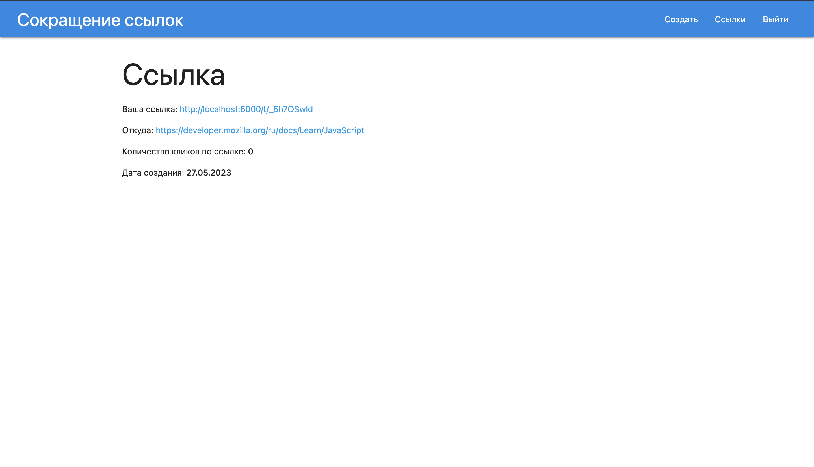

# Link Shortening | MERN 

Libs:  
- REACT  
- Node.JS  
- Express  
- Mongoose  
- JWT  

Register and then sign in to the application.  
Paste the link into the input field to make it shorter.  
Get result.  
The results will display the original link and the short version of the link will be displayed, as well as the creation date and the number of clicks on the link.  

---

## Preview:  

