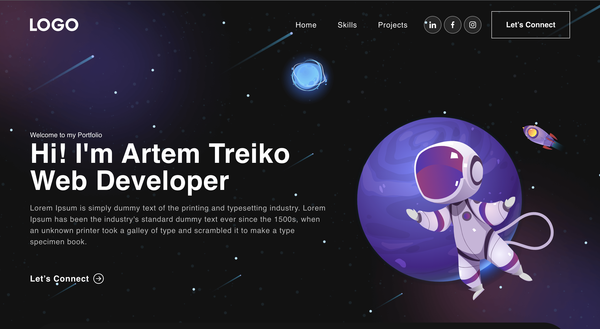

# Portfolio | React  

`npx create-react-app`

https://react-bootstrap.github.io/getting-started/introduction :    
`npm i bootstrap react-bootstrap`  
`npm i react-bootstrap-icons --save`  
`import 'bootstrap/dist/css/bootstrap.min.css'`  

Carousel :  
`npm i react-multi-carousel`  
`import 'react-multi-carousel/lib/styles.css'`  

Mail :   
`npm i react-mailchimp-subscribe`  

Animate :  
https://animate.style/  
`npm install animate.css --save`  
`import 'animate.css'`  

Observer :  
`npm i react-on-screen`  

Backend :  
`npm i express nodemailer cors`

---

## Preview:  

